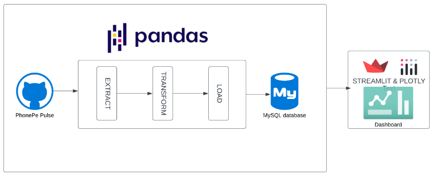

# 📊 PhonePe Pulse Data Visualization and Exploration: A User-Friendly Tool Using Streamlit and Plotly

Welcome to the **PhonePe Pulse Data Visualization Project**! Dive into an insightful exploration of PhonePe transaction data from **2018 Q1 to 2024 Q2**. This project demonstrates a seamless integration of **data extraction, cleaning, and visualization** using tools like **Python**, **Pandas**, **MySQL**, **Plotly**, and **Streamlit**.

---

## 🛠️ General Workflow of the Project

---

## 🗂️ Basic Schema of the Application

The application is divided into three main sections:

### 1. **Data Overview**
   - Provides a comprehensive overview of the entire dataset.
   - The data is divided into two main categories:
     - **Transactions**:
       - Displays the number of transactions and transaction amounts at the national level, broken down by states (Geo Visualization).
       - General trend analysis of transactions over the years (2018 Q1 to 2024 Q2).
       - State-wise comparison of transactions.
     - **Users**:
       - Shows the number of registered users and app openings (an indicator of app usage frequency).
       - Geo-visualization of user registrations and app openings over time.
       - State-wise comparison of registered users.

### 2. **Top Metrics**
   - **Transactions**:
     - Top 10 states with the highest transaction amounts.
     - Top 10 districts with the highest transaction amounts.
     - Top 10 pincodes with the highest transaction amounts.
     - Most popular payment methods.
   - **Users**:
     - Top 10 brands with the highest number of registered users.
     - Top 10 districts with the highest number of registered users.
     - Top 10 pincodes with the highest number of registered users.
     - Top 10 states with the highest number of registered users.

### 3. **Insights**
   - A dropdown feature to explore key insights and behavior patterns related to PhonePe users and transactions.

---

## 🚀 How to Set Up and Run the Project Locally

Follow these steps to run the project on your local machine:

1. **Clone the Repository**
2. **Set Up a Virtual Environment**
3. **Install Dependencies**
4. **Configure MySQL Database**
5. **Run the Streamlit Application**
6. **Interacting with the Dashboard**

## 💡 Features

* **Geo-Visualization:** Interactive maps to view transaction and user data across India by states, districts, and pincodes.
* **Time Series Analysis:** Trends of transaction amounts and registered users over time (2018 Q1 to 2024 Q2).
* **Top Metrics:** Get quick access to the top 10 states, districts, and pincodes with the highest transaction amounts and registered users.
* **Interactive Dropdowns:** Allow users to explore key insights into the PhonePe transaction data by selecting different options from the dropdown menu.

## Contact

* **Email:** shaikrahemathds@gmail.com
* **LinkedIn:** [Rahemath](https://www.linkedin.com/in/rahemath/)

